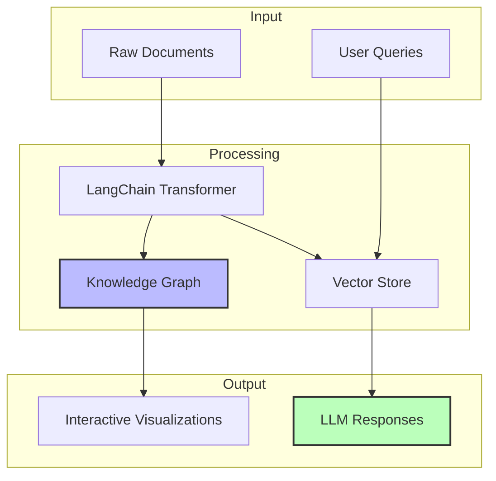
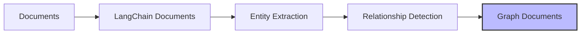
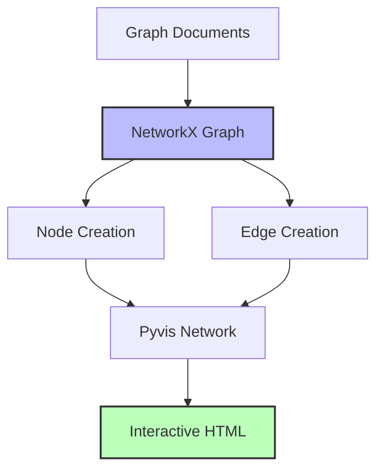
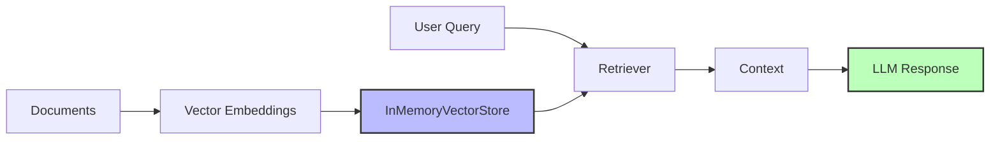
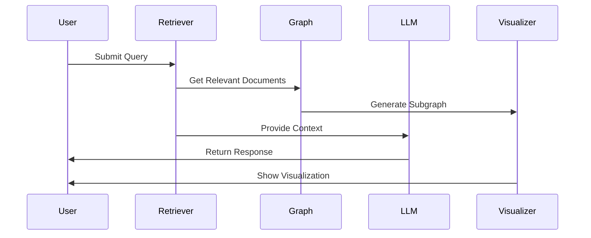
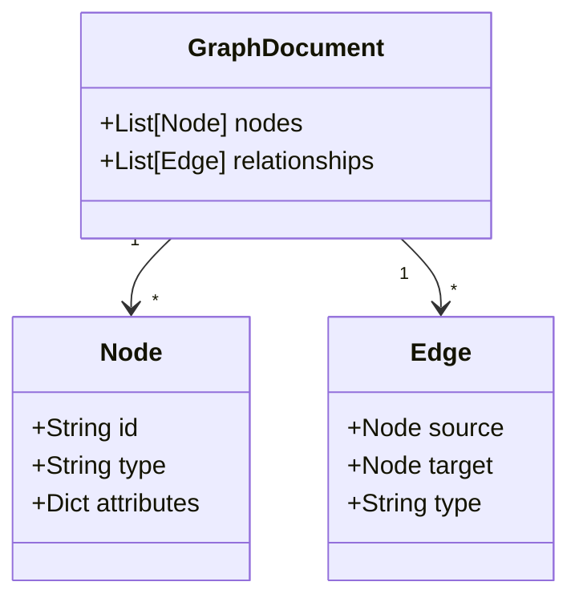
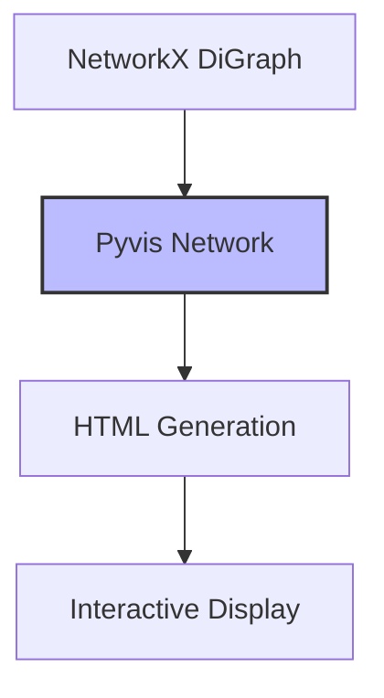

# LangChain Graph RAG Architecture

This document details the architectural components and data flow of the LangChain-based Graph RAG implementation.

## System Architecture



## Component Details

### 1. Document Processing Layer


#### Key Components:
- **Document Class**: LangChain's Document structure
- **LLMGraphTransformer**: Handles entity and relationship extraction
- **GoogleGenerativeAI**: Powers the extraction process

### 2. Knowledge Graph Construction


#### Visualization System:
- Uses Pyvis for interactive graphs
- Supports node/edge attributes
- Provides hover information
- Enables dynamic interaction

### 3. RAG Implementation


#### Components:
- **Embeddings**: GoogleGenerativeAIEmbeddings
- **Vector Store**: InMemoryVectorStore
- **Retriever**: Contextual document retrieval
- **RAG Chain**: Orchestrates the query process

### 4. Query Processing Flow


## Implementation Details

### 1. Model Configuration
```python
llm = ChatGoogleGenerativeAI(model="gemini-2.0-flash")
embeddings = GoogleGenerativeAIEmbeddings(model="models/embedding-001")
```

### 2. Graph Structure


### 3. Visualization Architecture


## Data Flow

### Document Processing
1. Raw document ingestion
2. Conversion to LangChain format
3. Entity and relationship extraction
4. Knowledge graph construction
5. Vector store population

### Query Processing
1. Query reception
2. Document retrieval
3. Subgraph generation
4. Context assembly
5. LLM response generation

## Performance Considerations

### Memory Management
- InMemoryVectorStore for small to medium datasets
- Efficient graph traversal with NetworkX
- Optimized visualization rendering

### Response Time
- Batch processing for document ingestion
- Efficient retrieval mechanisms
- Parallel processing where possible

### Scalability
- Modular design for easy extension
- Support for different LLM models
- Flexible visualization options

## Security Considerations

1. **API Key Management**
   - Environment variable usage
   - Secure key storage
   - Error handling for missing keys

2. **Data Processing**
   - Input validation
   - Error handling
   - Safe visualization generation

## Future Enhancements

1. **Scalability**
   - Persistent vector storage
   - Distributed processing
   - Batch query handling

2. **Visualization**
   - Custom styling options
   - Advanced filtering
   - Real-time updates

3. **Integration**
   - Additional LLM providers
   - Different embedding models
   - Alternative graph databases
