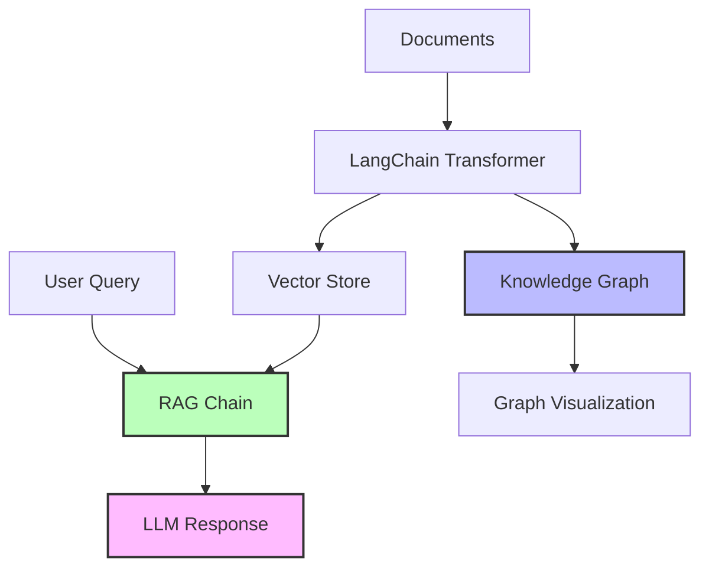
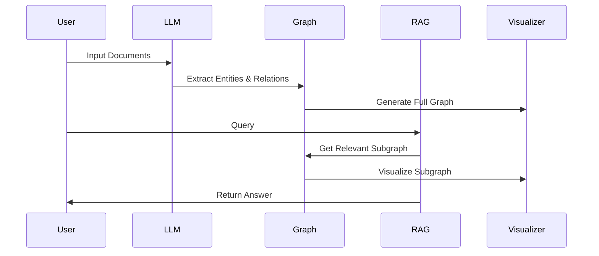

# LangChain Graph RAG Implementation 🔍

A sophisticated implementation of Graph-based Retrieval Augmented Generation using LangChain and Google's Generative AI, featuring interactive knowledge graph visualizations.

## Key Features

- � **Smart Entity Extraction**: Automatically identifies entities and relationships in documents
- 📊 **Interactive Visualizations**: Dynamic, interactive graph visualizations using Pyvis
- 🤖 **Google Gemini Integration**: Powered by Google's latest LLM models
- � **Contextual Retrieval**: Intelligent document retrieval based on query relevance
- 📈 **Query-Specific Subgraphs**: Visualize the relevant knowledge for each query
- ⚡ **Real-time Processing**: Interactive query processing with timing information
- � **Full RAG Pipeline**: Complete implementation from document ingestion to answer generation

## System Overview



The system processes documents through multiple stages:
1. Document ingestion and transformation
2. Entity and relationship extraction
3. Knowledge graph construction
4. Interactive visualization generation
5. Query processing with context retrieval
6. Response generation with visual support

## Installation and Setup

### Prerequisites
- Python 3.8 or later
- Google API key for Gemini model access
- pip package manager

### 1. Get Google API Key

1. Visit the [Google AI Studio](https://makersuite.google.com/)
2. Create an API key
3. Create a `.env` file in the project root:
```bash
GOOGLE_API_KEY=your_google_api_key_here
```

### 2. Install Dependencies

```bash
uv pip install -r .\requirements.txt
```

Required packages:
```txt
langchain-google-genai
google-generativeai
networkx
python-dotenv
langchain-experimental
langchain-community
pyvis
```

### 3. Run the Program

```bash
python .\simple_graph_rag.py
```

The system will:
1. Initialize models and components
2. Process sample documents
3. Generate visualizations
4. Accept interactive queries

## Project Structure

```
graph-rag-implementation/
├── simple_graph_rag.py  # Main implementation file
├── .env                 # Environment variables
├── requirements.txt     # Project dependencies
├── README.md           # Project documentation
├── Architecture.md     # Detailed architecture docs
├── knowledge_graph.html
└── query_subgraph.html
└── lib
```

## Usage Examples

### Interactive Mode
```txt
# Run the script directly for interactive mode
python .\simple_graph_rag.py
```

## Pipeline Steps



### 1. Document Processing
- Converts raw text to LangChain documents
- Extracts entities and relationships
- Builds knowledge graph structure

### 2. Graph Construction
- Creates NetworkX graph representation
- Adds nodes for entities
- Adds edges for relationships
- Generates interactive visualizations

### 3. Query Processing
- Retrieves relevant documents
- Creates query-specific subgraphs
- Generates contextual responses
- Provides visual feedback

### 4. Visualization
- Interactive graph exploration
- Node and edge information on hover
- Zoom and pan capabilities
- Dark theme for better visibility

## Error Handling

The system includes robust error handling for:
- Missing API keys
- Document processing errors
- Query execution failures
- Visualization generation issues

---

## Contribution

Contributions are welcome! Please fork the repository and submit a pull request with your improvements.