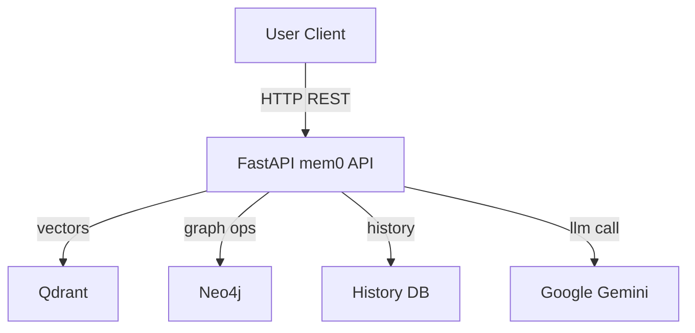
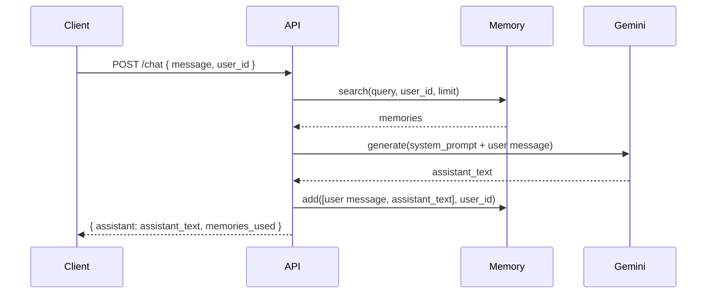

## Mem0-with-Gemini-LLM

## Executive summary

This repository implements a lightweight REST API server (FastAPI) that uses the "mem0" memory abstraction and integrates with a vector store (Qdrant by default), a graph store (Neo4j), and an LLM provider (Google Gemini via genai). The server exposes endpoints to add, search, update, delete and chat with stored memories. The project is designed to run via Docker Compose and includes docker images for the API, Qdrant and Neo4j.

Key runtime pieces:
- FastAPI application: `main.py`
- Memory library: `mem0` (imported as a Python package, not included in this repo)
- Vector store: Qdrant (Docker service)
- Graph DB: Neo4j (Docker service)
- LLM: Google Gemini via `google-generativeai` / `google-genai` client (external API)
- Local conversation history: SQLite file mounted at `/app/history/history.db`

## Files & purpose

- `main.py` — FastAPI application and all REST endpoints (primary server code)
- `docker-compose.yaml` — Services and orchestration (mem0 service, qdrant, neo4j, commented postgres)
- `Dockerfile` — Image for the API service (Python 3.12 slim, installs requirements, exposes uvicorn)
- `dev.Dockerfile` — Alternate development Dockerfile referencing an editable `mem0` install (expects `server` and `packages` layout)
- `requirements.txt` — PyPI runtime dependencies for the API
- `pyproject.toml` — Minimal project metadata
- `.env` / `.env.example` — Environment variables used by the app (contains secrets — see notes)

Note: The `mem0` library is referenced as an import. The repository expects the `mem0` package to be available (via pip, or via a volume mount during development). The `dev.Dockerfile` assumes a repo layout where `server/` and `mem0/` exist; ensure compose build context and paths match your folder layout.

## High-level architecture

The system is small and service-oriented. Main runtime dependencies are external services (Qdrant, Neo4j) and an external LLM provider (Gemini).



Notes:
- Qdrant stores embeddings and supports vector search used by the `Memory` instance.
- Neo4j stores graph relationships for richer knowledge linking.
- Gemini is called synchronously when the `/chat` endpoint is used.

## Component details (developer view)

main.py responsibilities:
- Load environment variables and default config
- Instantiate `Memory` via `Memory.from_config(DEFAULT_CONFIG)`
- Provide endpoints:
  - `POST /configure` — reconfigure memory instance dynamically
  - `POST /memories` — add messages as memories
  - `GET /memories` — retrieve memories by identifiers
  - `POST /search` — search for relevant memories
  - `POST /chat` — fetch memories, build system prompt, call Gemini, save conversation
  - `PUT/DELETE` endpoints for updating and deleting memories
- Basic error handling and logging

Key models (Pydantic):
- `Message` {role, content}
- `MemoryCreate` {messages, user_id?, agent_id?, run_id?, metadata?}
- `SearchRequest` {query, user_id?, run_id?, agent_id?, filters?}
- `ChatRequest` {message, user_id, limit}

Memory abstraction:
- The `Memory` class is responsible for integrating with vector/graph stores and the embedder/LLM. The exact implementation lives in the `mem0` package.

## Sequence diagram — chat flow



## API Contract (quick reference)

- POST /memories
  - Body: `MemoryCreate`
  - Returns: memory add result (provider-specific)
- POST /chat
  - Body: `ChatRequest`
  - Returns: { assistant: string, memories_used: [...] }
- POST /search
  - Body: `SearchRequest`
  - Returns: search results from `Memory.search`
- GET /memories
  - Query: `user_id|agent_id|run_id` (one required)
  - Returns: list of memories

See `main.py` for details and examples.

## Deployment & run instructions

The repository is designed to run with Docker Compose. You (the user) run:

```powershell
docker compose up --build
```

Notes about compose and Dockerfiles:
- `docker-compose.yaml` starts services `mem0` (the API), `qdrant`, and `neo4j`.
- The compose file refers to `build.context: ..` and `build.dockerfile: server/dev.Dockerfile` — check these paths match your local layout. If you run compose from the project root and the Dockerfile is `dev.Dockerfile` in the same folder, change the compose `build` to use the correct context and dockerfile path.

## Environment variables (high level)

The app uses environment variables for DB endpoints, API keys and configuration. Important variables:
- `GOOGLE_API_KEY` — Gemini API key (sensitive)
- `NEO4J_URI`, `NEO4J_USERNAME`, `NEO4J_PASSWORD`
- `QDRANT_URL`, `QDRANT_COLLECTION`
- `POSTGRES_*` variables (if using pgvector)
- `HISTORY_DB_PATH` — local sqlite history path

Security note: `.env` in this repo contains an LLM key value; do not commit secret keys to source control. If that key is real, rotate it now.

## Observations

1) Compose build paths mismatch
- The `docker-compose.yaml` references `server/dev.Dockerfile` and `context: ..` which looks like it expects a parent repo layout. In this repo the Dockerfiles are at the same level. If your compose is run from this folder, update `docker-compose.yaml` to use `context: .` and `dockerfile: dev.Dockerfile` (or move files accordingly).

2) Secrets in `.env`
- Remove secrets from repo, add `.gitignore` for `.env`, and use a secret manager (Docker secrets, Vault, GitHub Actions secrets) for CI/CD.

3) Hard dependency on `mem0` implementation
- The app expects `mem0` to be importable. For reproducible builds, pin a version in `requirements.txt` or vendor a simple shim for local dev.

4) Runtime validation and graceful degradation
- If `GOOGLE_API_KEY` is missing, the `/chat` endpoint currently raises a 400 error message

## Product perspective — use cases

Primary use case: Agents and users can store conversational memories, retrieve contextually-relevant memory to ground LLM responses, and maintain relationships via a graph DB.

## Final notes

- The repository is a concise, useful demo that wires mem0, vector store, graph DB and an LLM for conversational memory. It is close to runnable in a local Docker environment.

---

Files inspected during this analysis (non-exhaustive):
- `main.py` — API server
- `docker-compose.yaml` — compose config
- `Dockerfile`, `dev.Dockerfile` — container builds
- `requirements.txt`, `pyproject.toml` — dependencies
- `.env`, `.env.example` — env values
